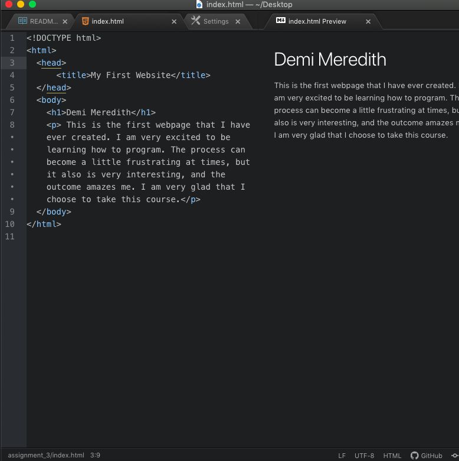

13. Web browsers are used each and every day to display web pages. A request is sent over a network to a server, and its responds with a collection of content as a response. After this occurs, the browser interprets the content that is returned and displays the contents page.
The components of a browser include:
The user interface which is the content that is presented to the user to interact with, this includes the address bar, the backwards and forwards buttons etc.
 A rendering engine (HTML, AND XML) which responsible for displaying the visual representation of the webpage. The rendering engine also takes in HTML and CSS documents and displays its documentation, not all browsers use the same rendering engine. The rendering engine also externally communicates with servers.
The browser engine which acts as a marshal and directs actions between the user interface.
The network, which is used to communicate and ask for all necessary documents, and programing language. The network then translates communication (there are multiple per browser).
Cookies/ data storage, which helps us retain data.  
The browsers that I currently use to surf the internet include, Google Chrome, and Safari.
14. Markup language is a complex system. Everything that one sees on the web is a combination of markup (text), style (design), and scripts (interactivity). Markup is essentially the architecture of the page and focuses on the text that is within the context, etc. One commonly used markup language that is used is, Hypertext Markup Language (HTML, or HTM). This is the most commonly used web language and uses a standardized element and tagging system. Hypertext markup language also is used to render context and page structure. Although there are many pros of using Hypertext Markup Language, there are also a few cons, including that it has consistent version changes which require many hours of require education, and that the quality of HTML usage varies this means that it’s  sites may not work across cross- browser or cross devices.
15.
