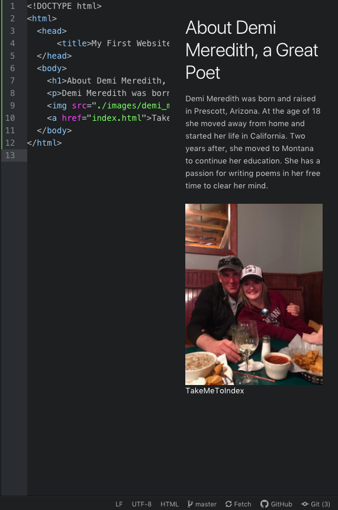

13. I visited https://www.facebook.com when using the wayback machine. As i navigated the changed that have been made over time, I noticed that the appearance of your initial login experience is very similar. The website as a whole is much more sophisticated and intricate as the years progressed to the future. Overall, Facebook looks much more slick and appears to be more user friendly.
14. Throughout using the GIT Module, there were many new things that I learned. I found it fascinating that I was able to create a file on Atom, and the file was able to automatically transfer over to GitHub Desktop. I learned that there are multiple ways to accomplish a common goal via Github.com, and on the GitHub Desktop module. I also learned that the when coding, Atom is very particular in the order in which symbols are displayed and coded in order to produce an accurate and viable webpage, in order to create an accurate link and display on the overall webpage.
15. 
